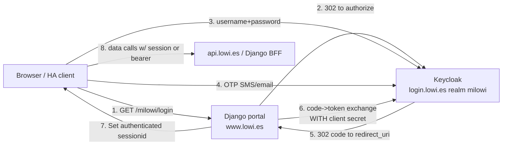

# Lowi (`milowi`) — Auth & API Research

> Reverse-engineering notes for a Home Assistant integration against the **Mi Lowi**
> customer portal. Lowi is a Vodafone España MVNO.
> Scope: **website / web portal path** (`www.lowi.es/milowi`). The mobile-app path
> (`auth.lowi.es`) is characterised in the appendix but not the focus.
>
> **Status: COMPLETE for the website path.** Auth flow (incl. SMS-OTP) confirmed from a
> real login HAR; all data-endpoint URLs **and JSON schemas** captured (§6.1) with a
> derived HA entity map (§6.2). Enough to build the integration. Only optional
> nice-to-haves remain (§8): the `set_current_line` request body and measured session
> longevity. Nothing below is invented.
>
> _Last updated: 2026-07-16 · verified by live HTTP probes + a login HAR + authenticated endpoint captures._

---

## 1. TL;DR / the one thing that shapes everything

The portal authenticates against **Keycloak** (realm `milowi`, client `web-client`)
using **OpenID Connect Authorization Code + PKCE**, with an **SMS OTP second factor** —
this is the "MFA in the browser" you saw. Because the account has several lines,
Keycloak makes you **pick which number receives the SMS** before entering the code.

**Critical constraint:** `web-client` is a **confidential** Keycloak client (it requires
a client secret at the token endpoint — confirmed by live probe). That secret lives
server-side in the Django backend and **is not recoverable from the browser**.

**Consequence for the integration:** you **cannot** run a clean "get access_token →
refresh forever" loop on your own, because you can't authenticate to the token
endpoint. Instead the integration must **replicate the browser session flow** and let
the Lowi Django backend do the code→token exchange for you, then ride the resulting
**session cookie** (with silent Keycloak SSO re-auth to avoid re-entering the OTP).
Details in [§5](#5-recommended-auth-strategy-for-home-assistant).

---

## 2. System architecture

| Host | Role | Tech (observed) | Notes |
|---|---|---|---|
| `www.lowi.es/milowi/` | Customer portal (SPA + BFF) | **Django** (`sessionid`, `django_language` cookies), Apache | Behind **Imperva/Incapsula** WAF (`visid_incap_*`, `incap_ses_*` cookies). Also fronted by AWS API Gateway (`apigw-requestid` header). |
| `login.lowi.es` | Identity Provider | **Keycloak** (realm `milowi`) | Kubernetes ingress (`INGRESSCOOKIE`). Also fronted by **Imperva** (HAR shows its `/tarthen-my-say-…` sensor beacons) but it did **not** block plain HTTP clients in testing. This is where login + OTP happen. |
| `api.lowi.es` | REST data API | JSON API behind a gateway | Uniform auth-gated error envelope `{"errors":[{"description","code"}]}`. Requires a bearer token. |
| `auth.lowi.es` | **Separate** OAuth2 authorization server | Spring-style (`/oauth2/token`, "…on the authorization server") + AWS ELB/CloudFront | Almost certainly the **mobile app** backend. See [Appendix B](#appendix-b-mobile-app-authorization-server-auth-lowies). |
| `statics.pro.env.lowi.es` | Static assets | AmazonS3 / CloudFront | SPA assets, images. |



---

## 3. Keycloak / OIDC reference

Discovery document (public):
`https://login.lowi.es/realms/milowi/.well-known/openid-configuration`

| Purpose | Endpoint |
|---|---|
| Issuer | `https://login.lowi.es/realms/milowi` |
| Authorization | `…/protocol/openid-connect/auth` |
| Token | `…/protocol/openid-connect/token` |
| UserInfo | `…/protocol/openid-connect/userinfo` |
| Logout | `…/protocol/openid-connect/logout` |
| JWKS | `…/protocol/openid-connect/certs` |
| Token introspect | `…/protocol/openid-connect/token/introspect` |
| Revoke | `…/protocol/openid-connect/revoke` |
| Login form POST target | `…/login-actions/authenticate` |

Key capabilities advertised:

- `grant_types_supported`: includes `authorization_code`, `refresh_token`,
  `password`, `client_credentials`.
- `code_challenge_methods_supported`: `S256`, `plain` → **PKCE supported**.
- `scopes_supported`: includes `openid`, `email`, `phone`, `profile`,
  **`offline_access`** (long-lived refresh token — but only usable if you can auth to
  the token endpoint, see §1).
- Client used by the web portal: **`client_id=web-client`**, **confidential**
  (client-secret required — confirmed by probe returning `unauthorized_client` /
  "Invalid client or Invalid client credentials").

### Confirmed authorization request

Initiated by Django's `GET https://www.lowi.es/milowi/login/`, which 302-redirects to:

```
https://login.lowi.es/realms/milowi/protocol/openid-connect/auth
  ?client_id=web-client
  &redirect_uri=https%3A%2F%2Fwww.lowi.es%2Fmilowi%2Foauth%2F
  &response_type=code
  &scope=openid
  &userId=
  &userType=no+cliente
```

(When you build the request yourself, add `state`, `code_challenge`,
`code_challenge_method=S256` — Keycloak accepts them and the real client uses them.)

---

## 4. The login + MFA flow (step by step)

Every step below is confirmed from a real login HAR, including the SMS-OTP exchange.

### Step 1 — Get the login page
`GET` the authorization URL above (browser-like `User-Agent`, keep a cookie jar).
Keycloak returns HTML and sets `AUTH_SESSION_ID`, `KC_RESTART` cookies. The form:

```html
<form id="kc-form-login" method="post"
      action="https://login.lowi.es/realms/milowi/login-actions/authenticate
              ?session_code=<S>&execution=<E>&client_id=web-client&tab_id=<T>">
```

- Page title: `Inicia sesión en Mi Lowi`.
- Fields: **`username`**, **`password`**, `rememberMe`, `credentialId`.
- Note the JS globals `window.otpChannel = ""` and `window.otpFlow = ""` — the theme's
  hooks for the OTP step; empty on step 1, populated once OTP is triggered.
- You must extract `session_code`, `execution`, `tab_id` from the form `action`
  (they change every request).

### Step 2 — Submit credentials  ✅ HAR-confirmed
`POST` the form `action` URL (execution = the password authenticator, observed
`def6d736-1093-43dc-ae17-25a5a946aa1b`) with the cookie jar and body:

```
username=<DNI/NIF>&password=<password>&rememberMe=on&credentialId=
```

- **Username is your DNI/NIF** (national ID), not email/phone, in the observed capture.
- Response `200` returns the **phone-selection form** — a *new* execution
  (observed `974e928f-f0ac-4bda-a062-be71f84f1129`) belonging to the **SMS-OTP
  authenticator**. (If MFA were skipped — e.g. valid SSO cookie — this would instead
  be a `302` straight to the callback.)

### Step 3 — Select phone + trigger SMS  ✅ HAR-confirmed
The OTP is **always SMS**, but the account has multiple lines, so Keycloak first asks
*which* of your numbers should receive the code. `POST` to the same `authenticate`
endpoint (OTP execution) with:

```
selectedPhone=<one of your MSISDNs>&next=Enviar+código
```

- Parse the radio-list of numbers from the returned HTML to know the valid
  `selectedPhone` values (make it a config option in HA).
- `next=Enviar código` ("Send code") is the submit button; this **sends the SMS**.
- Response `200` returns the **OTP-entry form** (same execution).

### Step 4 — Submit the SMS code  ✅ HAR-confirmed
`POST` again to the same `authenticate` endpoint (OTP execution) with the code the
user received by SMS. **The field name is `code`** (not the stock Keycloak `otp`):

```
code=<6-digit SMS code>
```

On success → `302` to:
```
https://www.lowi.es/milowi/oauth/?next=%2Fmilowi%2F
   &session_state=<uuid>&iss=https%3A%2F%2Flogin.lowi.es%2Frealms%2Fmilowi&code=<CODE>
```

> Every `POST` in steps 2-4 must carry the fresh `session_code`/`execution`/`tab_id`
> scraped from the previous response's form `action`, plus the accumulated cookie jar
> (`AUTH_SESSION_ID`, `KC_RESTART`, and Keycloak SSO cookies).

### Step 5 — Code → session (done by Django, not you)  ✅ HAR-confirmed
The browser follows the `302` to `https://www.lowi.es/milowi/oauth/?code=…`. **Django**
exchanges the code at the token endpoint **using the confidential client secret**,
stores the tokens server-side, and sets an **authenticated `sessionid`** cookie
(`Domain=.lowi.es`, `HttpOnly`, `Secure`; observed `Max-Age=2400` ≈ 40 min).

You never see the client secret or the tokens — you inherit the authenticated
`sessionid`. Confirmed from the HAR: the SPA does **not** receive a bearer token; all
data calls are same-origin and cookie-authenticated (see §6).

---

## 5. Recommended auth strategy for Home Assistant

Because `web-client` is confidential, the durable, HA-friendly approach is
**session emulation with silent SSO refresh**:

**Config-flow (interactive, once):**
1. Start a cookie session (`httpx.AsyncClient`, browser-like headers, `follow_redirects`).
2. `GET /milowi/login/` → follow to Keycloak → scrape the login form.
3. Config-flow **step 1**: user enters username + password → POST to `login-actions/authenticate`.
4. If an OTP form comes back → config-flow **step 2**: user enters the OTP → POST it.
5. Follow the redirect back to `/milowi/oauth/?code=…`; Django sets the authenticated `sessionid`.
6. **Persist the cookie jar** (Keycloak SSO cookies `KEYCLOAK_IDENTITY`,
   `KEYCLOAK_SESSION`, plus Django `sessionid`) in the config entry. Send
   `rememberMe=on` so the Keycloak SSO session is long-lived.

**Coordinator (unattended polling):**
- Call the data endpoint(s) with the stored `sessionid`.
- On `401/302-to-login` (session expired), do a **silent re-authorization**: repeat the
  authorize request reusing the persisted `KEYCLOAK_IDENTITY` cookie with **`prompt=none`**.
  If the Keycloak SSO session is still alive, Keycloak returns a fresh `code`
  **without** asking for password/OTP → Django mints a new `sessionid`. No user
  interaction, no new OTP.
- Only when the SSO session itself has expired do you need to re-run the interactive
  flow (surface a re-auth in HA). The exact SSO Session Max/Idle isn't measured yet
  (see §8) — with `rememberMe` it's typically days; the coordinator should just treat a
  failed silent refresh as "trigger HA re-auth".

**Why not the shortcuts:**
- *Direct `password` grant against Keycloak* → `web-client` is confidential and MFA is
  enforced in the browser flow; probe returned `unauthorized_client`. Not viable.
- *Grab access_token + refresh_token from the browser and refresh yourself* → refresh
  also requires client authentication (confidential). Not viable without the secret.

### Client library notes
- Both `login.lowi.es` and `www.lowi.es` sit behind **Imperva/Incapsula** (the HAR
  shows its obfuscated `/tarthen-my-say-…` and `/side-Host-…` sensor beacons on both).
  It ran in monitor mode — plain requests were **not** blocked in testing — but treat
  active JS challenges as a possible future failure mode.
- `www.lowi.es` live probes returned clean `302`s with just
  a browser `User-Agent` (no active JS challenge observed). Keep realistic headers
  (`User-Agent`, `Accept`, `Accept-Language: es`). **Fallback if Imperva starts
  challenging:** use [`curl_cffi`](https://github.com/yifeikong/curl_cffi) or a
  TLS-fingerprint-impersonating client instead of vanilla `httpx`.

---

## 6. Data API access

**Resolved by HAR:** the web SPA uses the **Django BFF** (approach b). There were
**zero** calls to `api.lowi.es` and **no bearer tokens** in the browser — every data
call is a same-origin `GET https://www.lowi.es/api/...` authenticated purely by the
**session cookie**. So the §5 session strategy is exactly right, and the poller just
calls these same-origin URLs with the stored cookie jar. (`api.lowi.es` is a separate
backend, likely what the BFF calls server-side and/or the mobile app — not needed here.)

### Multi-line model (important — simpler than expected)
The account has **6 subscriptions** (mobile lines + fibre + TV). Contrary to the earlier
guess, the core endpoints are **account-wide**: `/api/milowi/v1/me` and
`/api/milowi/v1/me/consumptions` each return **all** subscriptions in one response,
keyed by `subscription_id`. So **`set_current_line` is NOT needed** for polling usage —
a single `GET /me/consumptions` yields every line. `set_current_line` only affects other
contextual portal views. Enumerate lines + tariff detail via `/api/2.0/me/subscriptions`.

### Endpoint map  ✅ URLs + schemas confirmed
Base host: `https://www.lowi.es`. Auth: **session cookie** (no bearer). All `GET`
unless noted. Schemas in §6.1.

| Feature | Method | Path | Resp | Notes |
|---|---|---|---|---|
| OAuth callback (sets session) | GET | `/milowi/oauth/?code=&iss=&session_state=&next=` | 302 | Django does the confidential code→token exchange here |
| Profile + all lines | GET | `/api/milowi/v1/me` | json | account, bank, every subscription (no usage) |
| Client config / flags | GET | `/api/milowi/v1/me/config` | json | product limits, `may_has_debt`, `restricted_user` |
| **Usage / consumo** | GET | `/api/milowi/v1/me/consumptions` | json | **all lines' data/voice usage + monthly total** — the primary HA poll |
| Invoices list | GET | `/api/milowi/v1/me/billings` | json | array of invoices (id, date, price, status) |
| Invoice PDF | GET | `/api/milowi/v1/me/billings/{billingId}` | pdf | binary download |
| Lines + tariff detail | GET | `/api/2.0/me/subscriptions` | json | packages, products, prices, addons |
| Account (legacy) | GET | `/api/2.0/me` | json | flat profile; has `account_id` |
| Switch active line | POST | `/milowi/config/set_current_line/` | json | not needed for usage (see multi-line note) |
| Per-line offers | GET | `/api/milowi/v1/subscriptions/{subId}/personal_offers` | json | marketing; ignore |
| Marketing banner | GET | `/api/1.0/banner?device=&location=` | json | ignore |

All timestamps are **Unix epoch seconds**. Money is decimal in the field's `currency`
(`€`). `subscription_id` links `/me`, `/me/consumptions` and `/me/subscriptions`.

---

## 6.1 Response schemas (captured, PII elided)

### `GET /api/milowi/v1/me` — account + all subscriptions
```jsonc
{
  "object": "user",
  "id": 3337272,
  "name": "…", "first_last_name": "…",        // PII
  "email": "…", "birthdate": "…", "contact_phone": "…", "document": "…", // PII
  "status": "ACTIVE",
  "accounts": [{
    "id": 3373584,
    "bank_account_owner": "…", "bank_account": "…", "billing_address": "…", // PII (IBAN)
    "subscriptions": [{
      "id": 7192706,
      "type": "MOBILE",            // MOBILE | INTERNET | TV
      "msisdn": "…",               // PII; absent for INTERNET
      "status": "ACTIVE",
      "priority_class": "PRIMARY", // PRIMARY | SECONDARY
      "creation_date": 1727806317, "modification_date": …, "activation_date": …, // epoch s
      "order_id": 20740312,
      "provider": "AMAZON"         // only on TV subs
    }]
  }]
}
```

### `GET /api/milowi/v1/me/consumptions` — **primary HA endpoint** (all lines)
```jsonc
{
  "object": "user_consumption",
  "summary": {
    "total_price": { "amount": "27.79", "currency": "€" },  // current month so far
    "billing_period_start": 1782856800,                     // epoch s
    "billing_period_end": 1785535199,
    "is_prorated": false,
    "next_month_price": null
  },
  "subscriptions": [{
    "subscription_id": 7192706,
    "status_detail": null, "provider_status": null,
    "consumptions": {
      "data_consumption": {          // present only for MOBILE lines
        "is_unlimited": false,
        "resume":   { "quantity": {"value":"400.0","unit":"GB"}, "available": {"value":"398.9","unit":"GB"} },
        "included": { "quantity": {"value":"150.0","unit":"GB"}, "available": {"value":"150.0","unit":"GB"} },
        "extra":    { "quantity": {"value":"250.0","unit":"GB"}, "available": {"value":"248.9","unit":"GB"},
                      "sections": [ {"name":"Acumulados del mes anterior","quantity":{"value":"198.9","unit":"GB"}} ] }
      },
      "voice_consumption": { "is_unlimited": true },  // when unlimited: no counters
      "extra_consumption": null
    },
    "extra_info": null,
    "roaming": { "zones": ["1"], "bonds": null }   // null for non-mobile
  }]
  // INTERNET / TV subs appear with consumptions:{ "extra_consumption": null } only
}
```
**Derivations for sensors** (values are strings — parse to float):
- **total** GB = `resume.quantity.value`  ·  **remaining** GB = `resume.available.value`
- **used** GB = `resume.quantity.value − resume.available.value`
- `included` = base plan bucket; `extra` = bonuses/rollover (`sections[]` explains them,
  e.g. *"Acumulados del mes anterior"* = rollover, *"Bono de datos extra de Servicios TV"*).
- `voice_consumption.is_unlimited: true` ⇒ unlimited calls (no numeric usage exposed).

### `GET /api/milowi/v1/me/billings` — invoices (array)
```jsonc
[ { "id": 264172547, "date": 1780264800, "price": 28.36,
    "type": "INVOICE", "status": "PAID", "billing_date": null } ]
```
Newest first. PDF for each at `/api/milowi/v1/me/billings/{id}` (`application/pdf`).

### `GET /api/milowi/v1/me/config`
```jsonc
{ "object": "user_config",
  "product_limits": { "INTERNET":2, "MOBILE":…, "TV":4, "DEVICE":1, "SIM_SWAP":1, … },
  "restricted_user": false, "may_has_debt": false, "may_buy_devices": true,
  "has_autoi": [] }
```

### `GET /api/2.0/me/subscriptions` — packages, tariffs, addons
```jsonc
{ "data": [{
  "package_id": 706,
  "price": { "priceInCents": 1995, "price": 19.95, "currency": "€", "recurrence": "mes",
             "applied_discount": 300 },        // discount optional
  "name": "150GB/Unlimited + NEBAF 600Mbps - 19.95€",
  "tags": ["RETENTION","PENALTY_12_MONTH"],
  "subscriptions": [{
    "status": "ACTIVE", "type": "MOBILE", "msisdn": "…", "id": 7192706, "provider_status": "",
    "addons": [{ "type":"BOND_DATA","unit":"MB","current_limit":51200,"initial_limit":51200,
                 "contract_name":"Bono de datos extra de Servicios TV","quantity":51200,
                 "charging_amount":0,"product_id":883,"start_date":"2026-04-22T12:29:04.887",
                 "is_shareable":true,"price":{"price":0,"currency":"€","recurrence":"mes"} }],
    "product": {
      "product_id": 123, "name": "Mobile Data 150GB + Voice Unlimited - 4.95€",
      "charging_amount": 4.0909, "contract_name": "Tarifa 150GB + Llamadas Ilimitadas…",
      "type": "MOBILE", "priority": "PRIMARY",
      "product_items": [
        { "name":"Móvil 150 GB","type":"DATA","quantity":150,"is_unlimited":false,"unit":"GB" },
        { "name":"Llamadas Ilimitadas","type":"VOICE","quantity":3600000,"is_unlimited":true,"unit":"SECONDS" }
      ],
      "extra_info": [ {"description":"Ahora con 5G","is_highlighted":"Ahora con 5G"} ],
      "provider": "AMAZON"      // TV only
    }
  }]
}] }
```
`product_items[].type` ∈ {`DATA`,`VOICE`,`BROADBAND`,`TV`}; unit ∈ {`GB`,`MB`,`SECONDS`}.

### `GET /api/2.0/me` — flat profile
```jsonc
{ "data": { "name":"…","first_last_name":"…","second_last_name":"…","email":"…",
            "contact_phone":"…","birthdate":"…","document":"…",   // all PII
            "status":"ACTIVE","account_id":3373584 } }
```

---

## 6.2 Suggested Home Assistant entities

One `DataUpdateCoordinator` polling `GET /me/consumptions` (+ `/me/billings` less often),
with a `DeviceInfo` per subscription. Per **mobile** line:

| Entity | Source | Unit / class |
|---|---|---|
| `sensor.<line>_data_remaining` | `resume.available.value` | GB |
| `sensor.<line>_data_used` | `quantity − available` | GB |
| `sensor.<line>_data_total` | `resume.quantity.value` | GB |
| `sensor.<line>_data_used_pct` | used / total × 100 | % |
| `binary_sensor.<line>_voice_unlimited` | `voice_consumption.is_unlimited` | — |
| attributes | `included`/`extra`/`sections`, roaming zone, plan name | — |

Account-level (from the same poll):

| Entity | Source |
|---|---|
| `sensor.lowi_current_month_cost` | `summary.total_price.amount` (€, monetary) |
| `sensor.lowi_billing_period_end` | `summary.billing_period_end` (timestamp) |
| `sensor.lowi_last_invoice_amount` | `billings[0].price` (€) |
| `sensor.lowi_last_invoice_status` | `billings[0].status` (e.g. PAID) |
| `sensor.lowi_last_invoice_date` | `billings[0].date` (timestamp) |

Plan name / price per line come from `/me/subscriptions` (`product.name`,
`price.price`) — fetch once at setup, refresh occasionally.

---

## 7. Confirmed request/response cheat-sheet

```text
# Authorize (Django initiates; you can also build it directly)
GET https://login.lowi.es/realms/milowi/protocol/openid-connect/auth
    ?client_id=web-client&redirect_uri=https://www.lowi.es/milowi/oauth/
    &response_type=code&scope=openid[&state=..&code_challenge=..&code_challenge_method=S256]
 -> 200 HTML login form; sets AUTH_SESSION_ID, KC_RESTART

# Step 2: credentials  (execution = password authenticator)
POST https://login.lowi.es/realms/milowi/login-actions/authenticate
     ?session_code=<S>&execution=<E_pw>&client_id=web-client&tab_id=<T>
     Content-Type: application/x-www-form-urlencoded
     username=<DNI/NIF>&password=..&rememberMe=on&credentialId=
 -> 200 phone-selection form  (execution switches to E_otp)   [or 302 straight to callback if SSO skips MFA]

# Step 3: pick phone + send SMS  (execution = OTP authenticator)
POST .../login-actions/authenticate?session_code=<S2>&execution=<E_otp>&client_id=web-client&tab_id=<T>
     selectedPhone=<MSISDN>&next=Enviar+código
 -> 200 OTP-entry form  (same E_otp);  SMS is sent

# Step 4: submit SMS code  (field name is `code`, NOT `otp`)
POST .../login-actions/authenticate?session_code=<S3>&execution=<E_otp>&client_id=web-client&tab_id=<T>
     code=<6-digit SMS>
 -> 302 https://www.lowi.es/milowi/oauth/?next=/milowi/&session_state=<uuid>&iss=.../realms/milowi&code=<CODE>

# Step 5: callback -> Django exchanges code (confidential secret) -> sets session cookie
GET https://www.lowi.es/milowi/oauth/?code=<CODE>&iss=..&session_state=..&next=/milowi/
 -> 302 into /milowi/  (now authenticated by session cookie)

# Token endpoint — CONFIDENTIAL CLIENT (server-side only; needs client secret)
POST https://login.lowi.es/realms/milowi/protocol/openid-connect/token
 -> unauthorized_client without client credentials   (confirmed; why the integration
    rides the session cookie instead of doing its own token exchange)

# Data calls (authenticated by SESSION COOKIE; no bearer)
GET https://www.lowi.es/api/milowi/v1/me/consumptions   -> 200 application/json
```

---

## 8. Optional follow-ups (non-blocking)

The map is complete enough to build the integration. These would only add polish:

1. **`set_current_line` request body** — capture one `POST /milowi/config/set_current_line/`
   (DevTools → Network → click the request → Payload) if you ever want line-switching for
   the non-`me/*` views. Not needed for usage/billing polling.
2. **Session longevity** — note how long an idle session stays valid, and whether
   revisiting `/milowi/` after a while silently re-auths (Keycloak SSO) or forces the
   full OTP again. This tunes the coordinator's re-auth handling; the design already
   assumes silent `prompt=none` refresh with a fallback to interactive re-login.

<details>
<summary>Reusable capture snippet (browser console) — for re-grabbing any endpoint later</summary>

Log into `https://www.lowi.es/milowi/`, open DevTools → **Console**, paste this. It
fetches the endpoints with your session cookie, **redacts PII keys client-side**, and
copies the result to your clipboard:

```js
(async () => {
  const eps = [
    "/api/milowi/v1/me",
    "/api/milowi/v1/me/config",
    "/api/milowi/v1/me/consumptions",
    "/api/milowi/v1/me/billings",
    "/api/2.0/me",
    "/api/2.0/me/subscriptions",
  ];
  const PII = /(msisdn|phone|telefono|movil|mobile|email|mail|firstname|lastname|fullname|nombre|apellido|holder|titular|surname|iban|ccc|bank|account_?number|dni|nif|nie|document|passport|address|direccion|calle|street|city|ciudad|province|provincia|zip|postal|postcode|birth|nacimiento|latitude|longitude|iccid|imei|imsi|puk|pin|password|secret|token|cookie|card|pan|cvv)/i;
  const red = (o) => Array.isArray(o) ? o.map(red)
    : (o && typeof o === "object")
      ? Object.fromEntries(Object.entries(o).map(([k, v]) => [k, PII.test(k) ? "<redacted>" : red(v)]))
      : o;
  const out = {};
  for (const u of eps) {
    try { const r = await fetch(u, { headers: { Accept: "application/json" }, credentials: "same-origin" });
          out[u] = { status: r.status, body: red(await r.json()) }; }
    catch (e) { out[u] = { error: String(e) }; }
  }
  const s = JSON.stringify(out, null, 2);
  console.log(s); try { copy(s); } catch (_) {}
  return "Copied " + s.length + " chars to clipboard";
})();
```

Eyeball the output before sharing — it keeps functional values (data/voice counters,
units, plan names, dates, invoice amounts/status) and redacts identifying keys.

</details>

---

## 9. Practical & compliance notes

- **Your own account only.** This is standard Home Assistant interoperability with your
  own data. Poll gently (every few minutes, not seconds); the coordinator should back
  off on errors. Expect breakage when Lowi changes their backend.
- **Secrets:** store cookies/tokens in the HA config entry (encrypted at rest); never
  log them or commit them.
- **WAF/ToS:** don't hammer `www.lowi.es`; keep human-like request rates and headers so
  you don't trip Imperva. Don't redistribute captured tokens.

---

## Appendix A — raw evidence (probe log, 2026-07-15)

- `GET /milowi/login/` → `302 Location: https://login.lowi.es/realms/milowi/protocol/openid-connect/auth?client_id=web-client&redirect_uri=…%2Fmilowi%2Foauth%2F&response_type=code&scope=openid&userId=&userType=no+cliente`; sets `sessionid` (`Max-Age=2400`), Imperva `incap_*` cookies.
- Keycloak discovery: confidential-client-capable auth methods (`client_secret_basic`, `client_secret_post`, `private_key_jwt`…), PKCE `S256`, `offline_access` scope present, `password` + `refresh_token` grants present.
- Login form action carries `session_code` / `execution` / `tab_id`; inputs `username`, `password`, `rememberMe`, `credentialId`; `window.otpChannel`/`window.otpFlow` globals present.
- Token endpoint, `authorization_code` grant, no client creds → `{"error":"unauthorized_client","error_description":"Invalid client or Invalid client credentials"}` → **confidential**.
- `api.lowi.es` (all probed paths) → `500 {"errors":[{"description":"Internal error","code":"INTERNAL_ERROR"}]}`.
- `www.lowi.es/milowi/` → `302 /milowi/login/?next=/milowi/`; `/milowi/oauth/` → `302 /`.

## Appendix B — mobile app authorization server (`auth.lowi.es`)

Not the website path, but characterised for completeness (the Mi Lowi Android app,
package `com.milowi.app`, likely uses this):

- Self-describes as "the authorization server"; error envelope `{"error":"…"}`.
- `GET /oauth2/token` → `400` HTML (Bootstrap) → a real **Spring-style OAuth2**
  `/oauth2/token` endpoint exists.
- `GET /login` → `302 /error?error=Client+does+not+exist` → needs a `client_id`.
- No OIDC discovery document.

**Why it may matter later:** if the app uses a **public** client with a password/ROPC
grant, that could be a much simpler unattended-auth path than the confidential web
flow — but it requires extracting the `client_id` (and any embedded secret / request
signing) from the APK (jadx). Deferred per current scope (website first).
